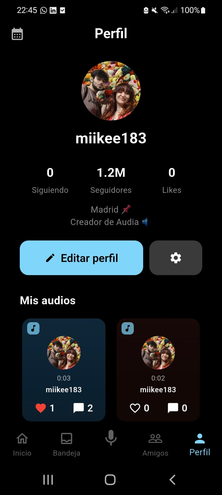
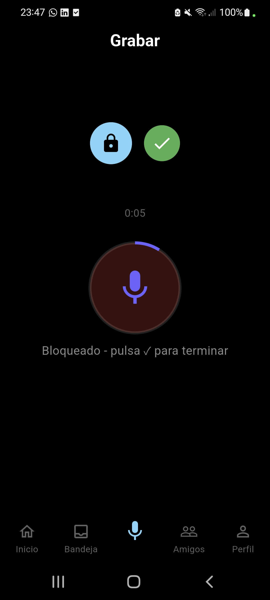
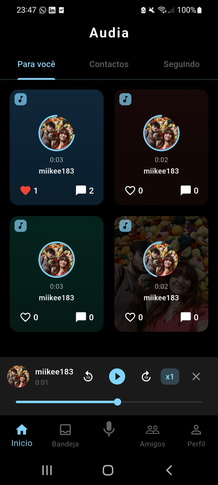
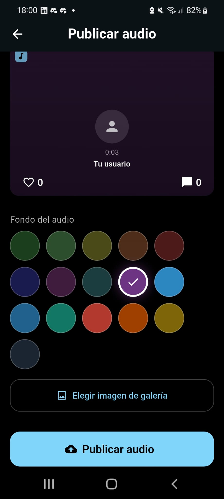
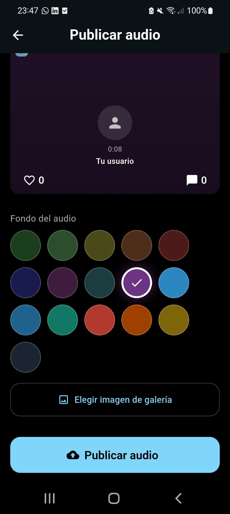
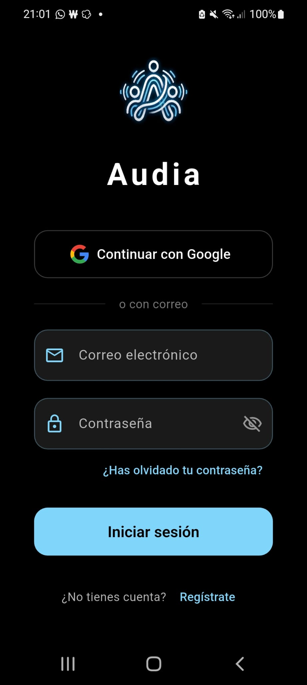
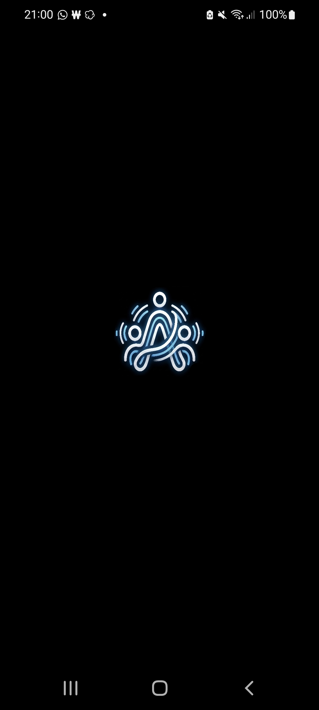
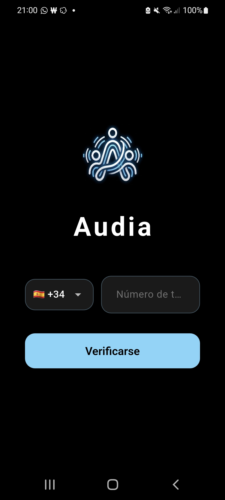
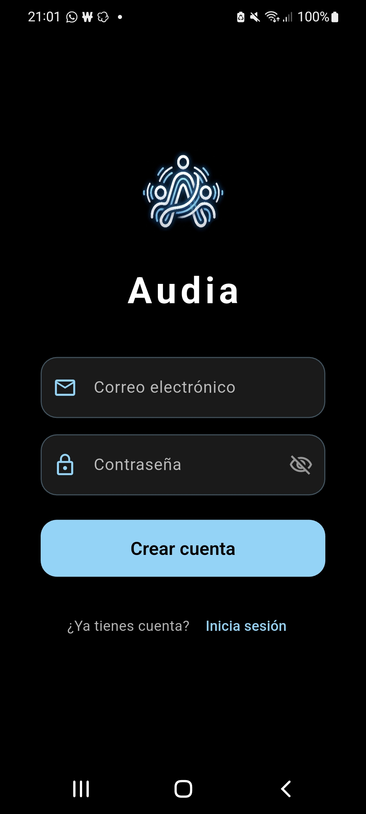

EN PLENO DESARROLLO

# Audia

Audia es una plataforma social de audio que te permite grabar y compartir clips de voz cortos (hasta 60 segundos) con tus amigos y seguidores. Es como una red social basada en voz: graba, publica, da like y comenta en publicaciones de audio.

## Funcionalidades

- **Grabación de Audio** — Mantén presionado para grabar con deslizamiento para bloquear, controles de reproducción y ajuste de velocidad
- **Feed** — Explora audios de todos, tus contactos o solo las personas que sigues
- **Social** — Sigue/deja de seguir usuarios, da like y comenta en publicaciones de audio
- **Cuentas Privadas** — Haz tu perfil privado para que solo los amigos mutuos puedan escuchar tus audios
- **Bloquear Usuarios** — Bloquea cuentas para evitar que interactúen con tu contenido
- **Localización** — App traducida a 11 idiomas (inglés, español, francés, portugués, alemán, italiano, ruso, árabe, chino, coreano, japonés)
- **Tema Oscuro y Claro** — Alterna entre modo oscuro y claro, persistente entre sesiones
- **Bandeja de Entrada** — Mira notificaciones de likes, comentarios y nuevos seguidores
- **Perfil** — Personaliza tu foto, nombre de usuario y biografía; revisa tu historial de audios

## Tech Stack

- **Frontend:** Flutter / Dart
- **Backend:** Python / FastAPI
- **Base de Datos:** PostgreSQL (SQLAlchemy ORM)
- **Autenticación:** Google Sign-In (Firebase Auth)
- **Almacenamiento Multimedia:** Cloudinary
- **Despliegue:** Render (backend), Google Play (frontend — próximamente)

## Capturas de Pantalla

| | | |
|:---:|:---:|:---:|
|  |  |  |
|  |  |  |
|  |  |  |
